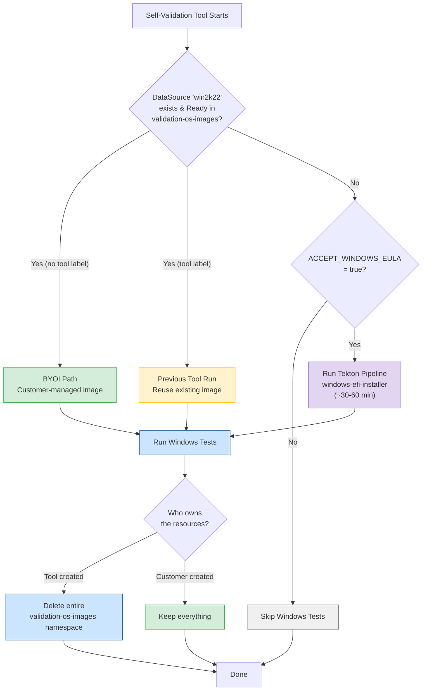
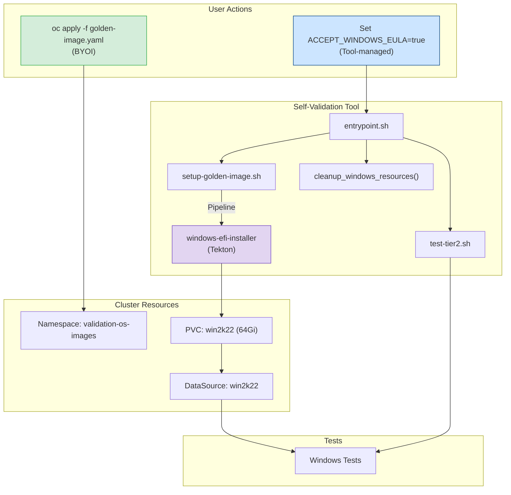

# Windows Golden Image Support

| | |
|---|---|
| **Author** | Ahmad Hafe |
| **Reviewers** | Ruth Netser, Oren Cohen, Natalie Gavrilov |
| **Status** | In Review |
| **Feature PR** | [#87](https://github.com/openshift-cnv/ocp-virt-validation-checkup/pull/87) |
| **Epic** | [CNV-84717](https://redhat.atlassian.net/browse/CNV-84717) |
| **Last updated** | July 2026 |

## Summary

Adds Windows Server 2022 test coverage to the self-validation tool by creating a golden image on-cluster using a [Tekton pipeline](https://artifacthub.io/packages/tekton-pipeline/redhat-pipelines/windows-efi-installer), instead of pulling from internal registries.

## Motivation

Storage partners (Pure, NetApp/GCNV, GCP Hyperdisk) run the self-validation tool on their clusters to certify their storage for OCP Virtualization GA. The long-term goal is for them to do this independently without us running tests on their behalf.

A [gap analysis](https://redhat.atlassian.net/browse/CNV-84224) against Peter Lauterbach's [GA Storage Criteria](https://docs.google.com/document/d/1XzBQtMQLMS3yidhqFhQDh1UYXB3yimIKUQtggJWABfM/edit) showed that Windows testing is missing from self-validation. The Tier-2/Tier-3 suite has Windows tests, but they pull images from internal Artifactory and private Quay. Cloud providers don't have those credentials and we can't share them. We're not Microsoft, we can't ship their OS. Partners need to create the Windows image on their own cluster.

## Goals

- Windows test coverage in self-validation, no dependency on internal registries
- Partners can create the image themselves via a [manifest](../manifests/windows/golden-image.yaml) (BYOI), or let the tool create it when the Microsoft EULA is accepted

## Prerequisites

| Prerequisite | Path |
|-------------|------|
| [OpenShift Pipelines](https://docs.openshift.com/pipelines/latest/about/about-pipelines.html) operator | Tool-managed |
| `ACCEPT_WINDOWS_EULA=true` env var | Tool-managed |
| Internet access to Microsoft ISO | Tool-managed (connected clusters) |
| [`manifests/windows/golden-image.yaml`](../manifests/windows/golden-image.yaml) applied | BYOI |
| Storage class with clone/snapshot support | Both |

## Design

The [`windows-efi-installer`](https://artifacthub.io/packages/tekton-pipeline/redhat-pipelines/windows-efi-installer) Tekton pipeline creates a Windows Server 2022 image from a publicly available Microsoft evaluation ISO. It runs an unattended install with our sysprep (EFI, vTPM, SSH, guest agent, `Administrator`/`Administrator`). The resulting disk is stored as a DataSource in a `validation-os-images` namespace, and tests clone from it.

Two paths:

**BYOI** - Partner applies [`manifests/windows/golden-image.yaml`](../manifests/windows/golden-image.yaml) which creates the namespace, runs the pipeline, and sets up the DataSource. Also works in disconnected environments (partner provides a local ISO URL). The tool detects the existing DataSource and runs Windows tests. Partner manages their own resources.

**Tool-managed** - Partner sets `ACCEPT_WINDOWS_EULA=true`. The tool creates the namespace (labeled `app=ocp-virt-validation`), runs the pipeline, runs tests, and deletes the namespace when done.

### Flow

### Components

### Cleanup

Either the tool owns the resources or the partner does, never a mix.

Tool-created namespaces get the `app=ocp-virt-validation` label. On cleanup, the tool deletes the entire namespace. Partner-created namespaces have no label, so the tool leaves them alone. If a previous tool run was interrupted and left stale resources in a partner namespace, the tool only removes the labeled resources and keeps the namespace.

## Related PRs

| PR | Status | Description |
|----|--------|-------------|
| [#87](https://github.com/openshift-cnv/ocp-virt-validation-checkup/pull/87) | In review | This feature |
| [OVT #4571](https://github.com/RedHatQE/openshift-virtualization-tests/pull/4571) | In review | Test fixture refactor — Adam Cinko |
| [#67](https://github.com/openshift-cnv/ocp-virt-validation-checkup/pull/67) | Merged | Initial Win11 golden image |
| [#84](https://github.com/openshift-cnv/ocp-virt-validation-checkup/pull/84) | Merged | Win11 → Server 2022 switch |

## References

- [GA Storage Criteria](https://docs.google.com/document/d/1XzBQtMQLMS3yidhqFhQDh1UYXB3yimIKUQtggJWABfM/edit) — Peter Lauterbach
- [Cloud Provider Sync Notes](https://docs.google.com/document/d/146x40wpeLPCYVcVMOQjwYno29qvdlh3OpSPxorLlkj0/edit) — Priya Parasuram
- [Gap Analysis — CNV-84224](https://redhat.atlassian.net/browse/CNV-84224)
- [windows-efi-installer pipeline](https://artifacthub.io/packages/tekton-pipeline/redhat-pipelines/windows-efi-installer)
- [Customer manifest](../manifests/windows/golden-image.yaml)
