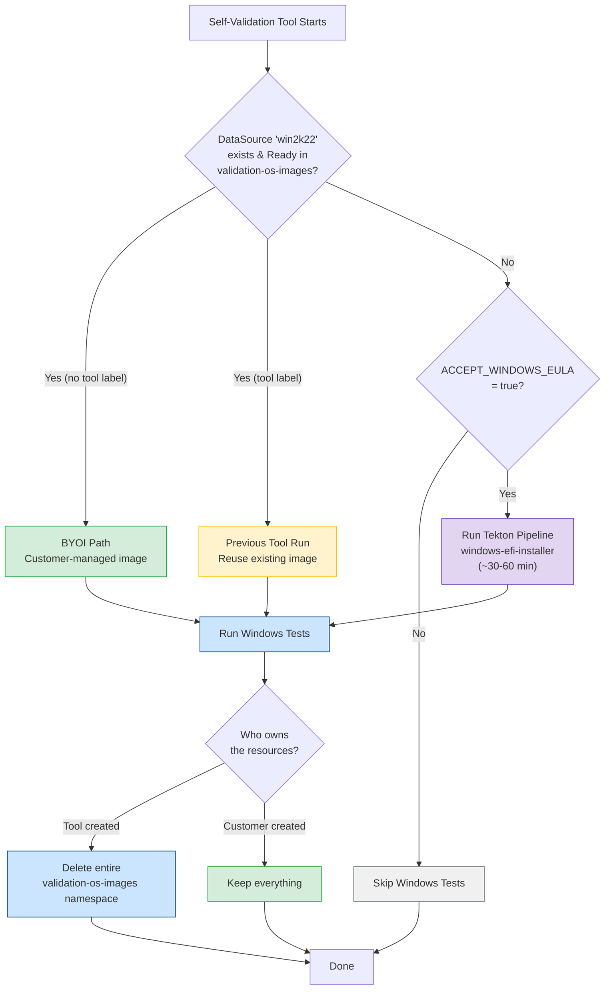
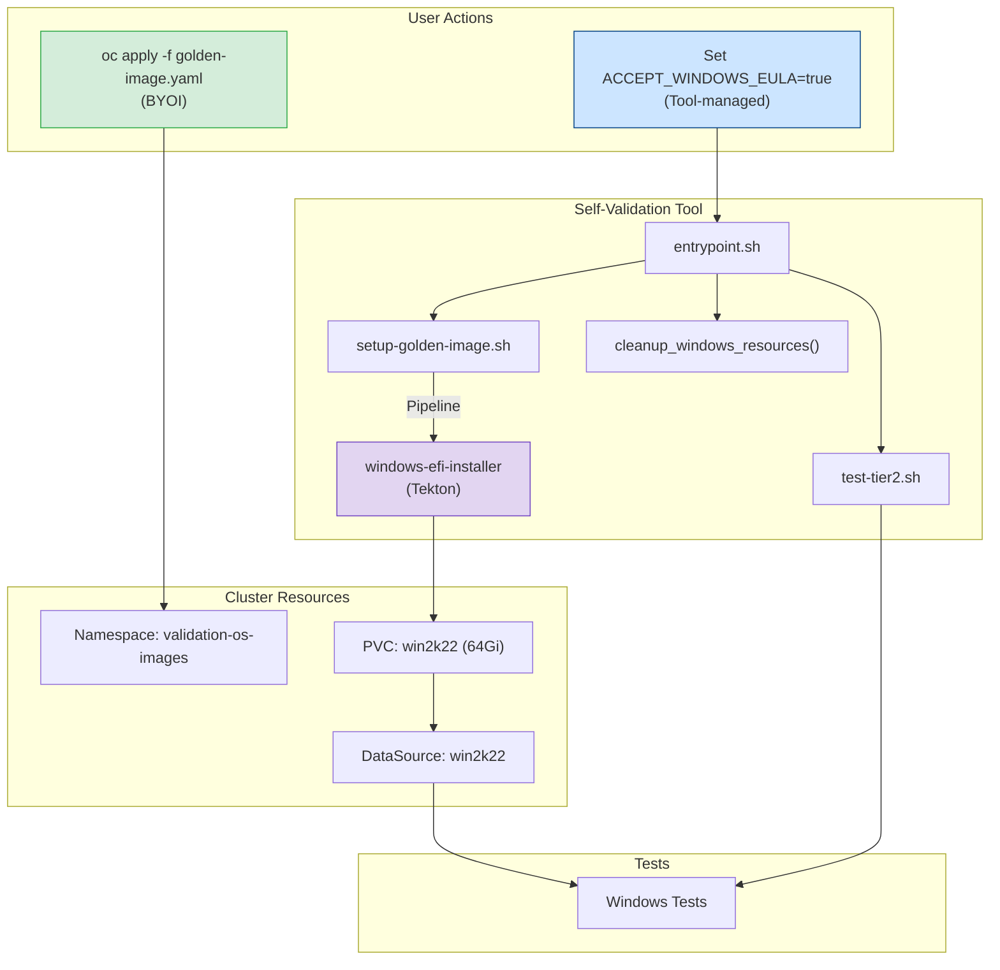
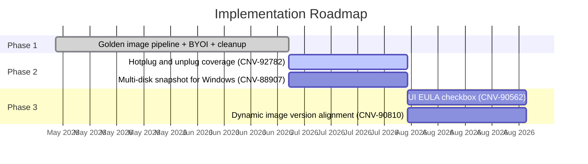

# Windows Golden Image Support

<table>
<tr><td><b>Author</b></td><td>Ahmad Hafe</td></tr>
<tr><td><b>Status</b></td><td>In Review</td></tr>
<tr><td><b>Feature PR</b></td><td><a href="https://github.com/openshift-cnv/ocp-virt-validation-checkup/pull/87">#87</a></td></tr>
<tr><td><b>Epic</b></td><td><a href="https://redhat.atlassian.net/browse/CNV-84717">CNV-84717</a></td></tr>
<tr><td><b>Jira</b></td><td><a href="https://redhat.atlassian.net/browse/CNV-74792">CNV-74792</a>, <a href="https://redhat.atlassian.net/browse/CNV-89353">CNV-89353</a></td></tr>
</table>

---

## Summary

Adds Windows Server 2022 test coverage to the self-validation tool by creating a golden image on-cluster using a [Tekton pipeline](https://artifacthub.io/packages/tekton-pipeline/redhat-pipelines/windows-efi-installer) instead of pulling from internal registries.

## Motivation

The [epic](https://redhat.atlassian.net/browse/CNV-84717) goal is to let cloud providers do the necessary verification of OpenShift Virtualization on their side, with minimal or no help from Red Hat. We don't provide a Windows licence or image to cloud providers, and the existing Tier-2/Tier-3 Windows tests depend on images stored in internal Artifactory and private Quay registries that are not accessible outside Red Hat.

To close this gap we need to give partners a way to create the Windows image on their own cluster using a publicly available source, while respecting Microsoft's EULA requirements.

### User Stories

As a storage partner running the self-validation tool, I want Windows tests included so that I can certify my storage without relying on Red Hat to run tests on my behalf.

As a partner in a disconnected environment, I want to bring my own Windows image so that I can run Windows tests without internet access.

As a cluster admin, I want the tool to clean up after itself so that test resources don't persist on my cluster after validation is complete.

## Goals

- Windows test coverage in self-validation, no dependency on internal registries
- Partners can create the image themselves via a [manifest](../manifests/windows/golden-image.yaml) (BYOI) or let the tool create it when the Microsoft EULA is accepted

---

## Prerequisites

**Both paths** require a storage class that supports clone or snapshot-based provisioning.

**BYOI path** requires applying [`manifests/windows/golden-image.yaml`](../manifests/windows/golden-image.yaml) before running the tool.

**Tool-managed path** requires:
- [OpenShift Pipelines](https://docs.openshift.com/pipelines/latest/about/about-pipelines.html) operator installed on the cluster
- `ACCEPT_WINDOWS_EULA=true` environment variable set
- Internet access to download the Microsoft evaluation ISO (connected clusters only)

---

## Proposal

The [`windows-efi-installer`](https://artifacthub.io/packages/tekton-pipeline/redhat-pipelines/windows-efi-installer) Tekton pipeline creates a Windows Server 2022 image from a publicly available Microsoft evaluation ISO, runs an unattended install with our sysprep configuration (EFI, vTPM, SSH, guest agent, `Administrator`/`Administrator`), and stores the resulting disk as a DataSource in a `validation-os-images` namespace that tests can clone from.

### Approach 1: Partner creates the image

The partner applies [`manifests/windows/golden-image.yaml`](../manifests/windows/golden-image.yaml) before running the tool. This creates the namespace, runs the pipeline, and sets up the DataSource. It also covers disconnected environments where the partner can provide a local ISO URL instead of downloading from Microsoft.

When the tool starts it detects the existing DataSource and runs Windows tests. Since the partner created the resources, the tool does not touch them on cleanup.

### Approach 2: Tool creates the image automatically

The partner sets `ACCEPT_WINDOWS_EULA=true` and the tool takes care of everything: it creates the namespace (labeled `app=ocp-virt-validation`), runs the pipeline, executes the tests, and deletes the namespace when done.

### Flow

### Components

### Cleanup

Either the tool owns the resources or the partner does, never a mix. Tool-created namespaces have the `app=ocp-virt-validation` label and get deleted entirely on cleanup, while partner-created namespaces have no label so the tool leaves them alone. If a previous tool run was interrupted and left stale resources in a partner namespace, the tool only removes the labeled resources and keeps the namespace.

---

## Alternatives Considered

| Approach | Why not |
|:---|:---|
| Ship a pre-built Windows container disk image via Quay | Microsoft EULA prohibits redistribution of Windows images, and partners outside Red Hat cannot access internal registries |
| Download a pre-built QCOW2 from Artifactory at test time | Same registry access problem, plus adds a hard dependency on internal infrastructure |
| Require the partner to manually create the VM and sysprep it | Too error-prone, not reproducible, and blocks automation |

The Tekton pipeline approach was chosen because it uses a publicly available ISO, runs entirely on-cluster, and produces a reproducible image without distributing any Microsoft binaries.

---

## Test Plan

| Scenario | What is verified |
|:---|:---|
| BYOI with existing DataSource | Tool detects the image, runs Windows tests, leaves all resources intact |
| Tool-managed with `ACCEPT_WINDOWS_EULA=true` | Pipeline creates the image, tests run, namespace is deleted on cleanup |
| EULA not accepted, no DataSource | Windows tests are skipped gracefully |
| Interrupted previous run (stale resources) | Tool removes only labeled resources, preserves partner-owned namespace |
| OpenShift Pipelines not installed | Tool skips Windows tests with a clear error message |

Windows tests run as part of the `tier2` suite and can be targeted individually with `TEST_FOCUS`.

---

## Risks and Mitigations

**OpenShift Pipelines not installed** on the target cluster. The tool-managed path requires Tekton. If it's missing the tool skips Windows tests with a clear message. The BYOI path has no Tekton dependency since the partner runs the pipeline themselves. Tracked in [CNV-92678](https://redhat.atlassian.net/browse/CNV-92678).

**Microsoft evaluation ISO URL changes**. The ISO download URL is configurable via `WIN_IMAGE_DOWNLOAD_URL` so partners can point to a mirror or a different version without code changes.

**Pipeline takes too long on slow storage**. The golden image build involves ~20 GB download and sysprep, which can take over an hour on some cloud storage classes. The pipeline timeout is configurable.

---

## Implementation Phases

---

## Feature PR

[#87](https://github.com/openshift-cnv/ocp-virt-validation-checkup/pull/87)
