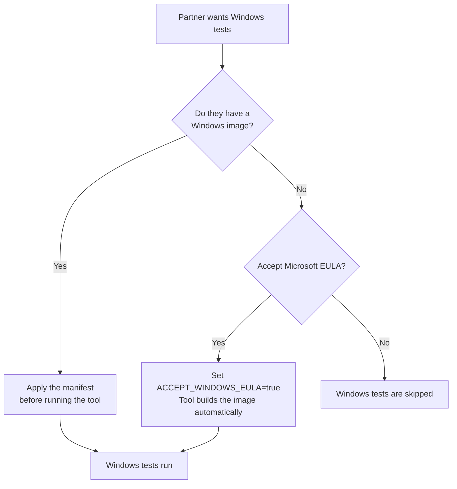

# Windows Golden Image Support

<table>
<tr><td><b>Author</b></td><td>Ahmad Hafe</td></tr>
<tr><td><b>Status</b></td><td>In Review</td></tr>
<tr><td><b>Feature PR</b></td><td><a href="https://github.com/openshift-cnv/ocp-virt-validation-checkup/pull/87">#87</a></td></tr>
<tr><td><b>Epic</b></td><td><a href="https://redhat.atlassian.net/browse/CNV-84717">CNV-84717</a></td></tr>
</table>

---

## Summary

Adds Windows Server 2022 test coverage to the self-validation tool by creating a golden image on-cluster using a [Tekton pipeline](https://artifacthub.io/packages/tekton-pipeline/redhat-pipelines/windows-efi-installer).

## Motivation

We don't provide a Windows licence or image to partners, so this feature lets them create the image on their own cluster and run Windows tests as part of storage certification.

### User Stories

As a storage partner running the self-validation tool, I want Windows tests included so that I can certify my storage without relying on Red Hat to run tests on my behalf.

As a partner, I want to bring my own Windows image so that I can run Windows tests even if my cluster has no internet access (disconnected environment).

## Goals

- Windows test coverage in self-validation, no dependency on internal registries
- Partners can create the image themselves via a [manifest](../manifests/windows/golden-image.yaml) or let the tool create it when the Microsoft EULA is accepted

---

## How It Works

The partner either **brings their own image** or **lets the tool create one**. If neither is done, Windows tests are skipped.

**Bring your own image** — Apply the provided [manifest](../manifests/windows/golden-image.yaml) before running the tool. The manifest can build the image from ISO using a Tekton pipeline, or import an existing image from an HTTP URL, a container registry, or an existing PVC. The tool detects the image, runs Windows tests, and never touches the partner's resources.

**Let the tool create it** — Set `ACCEPT_WINDOWS_EULA=true`. The tool builds the image from ISO via a Tekton pipeline, runs the tests, and cleans up everything when done. Requires [OpenShift Pipelines](https://docs.openshift.com/pipelines/latest/about/about-pipelines.html) and internet access.

---

## Cleanup

The rule is simple: **the tool only deletes what it created**.

| Who created the image? | What happens on cleanup? |
|------------------------|--------------------------|
| Partner brought their own | Nothing is deleted    |
| Tool created it           | Everything is deleted |

---

## Risks and Mitigations

| Risk | Mitigation |
|------|------------|
| OpenShift Pipelines not installed | Windows tests are skipped with a clear message. Partners can bring their own image instead. |
| Microsoft ISO URL changes | The URL is configurable via `WIN_IMAGE_DOWNLOAD_URL` |
| Pipeline is slow on some storage | The build involves ~20 GB and can take 30–60 min depending on storage performance |

---

## Feature PR

[#87](https://github.com/openshift-cnv/ocp-virt-validation-checkup/pull/87)
