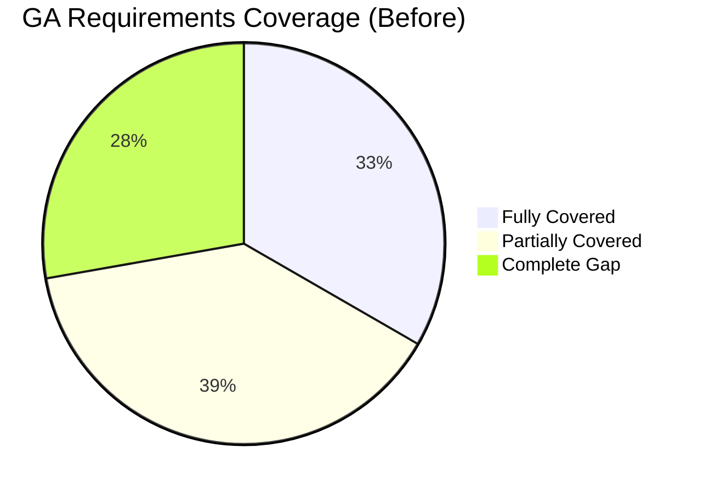
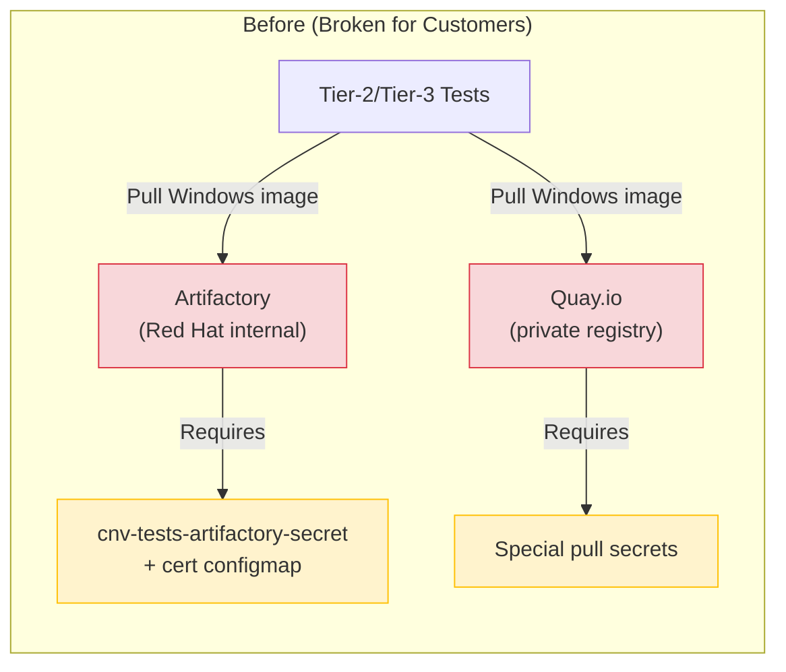
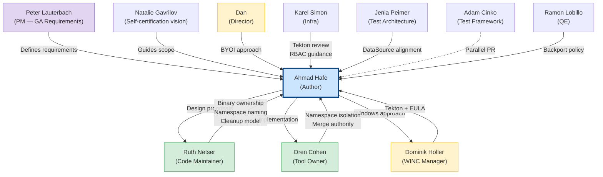
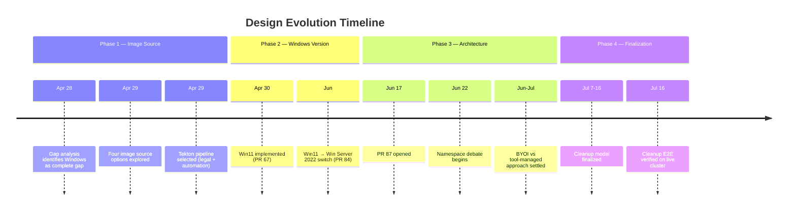
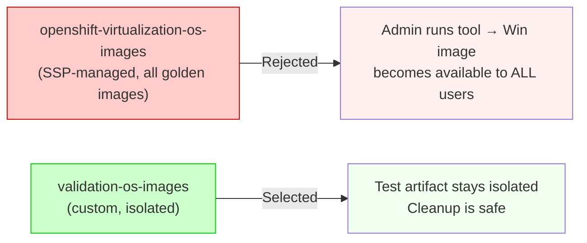
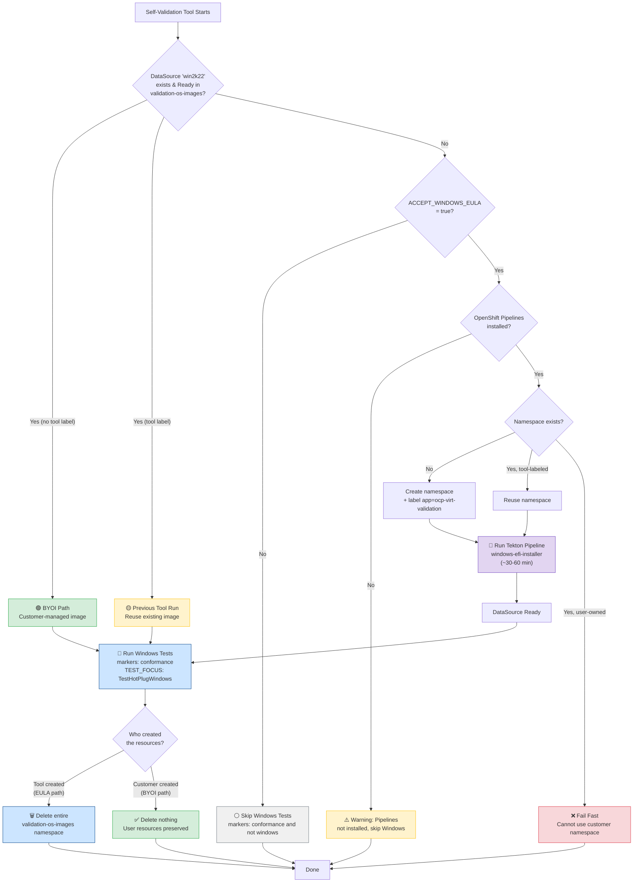
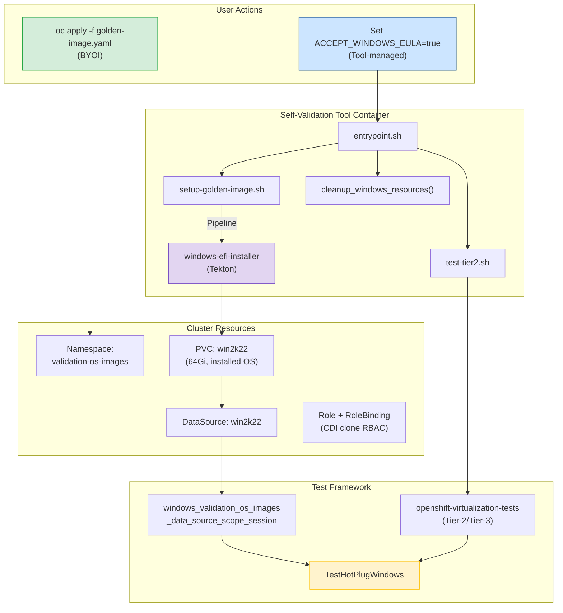
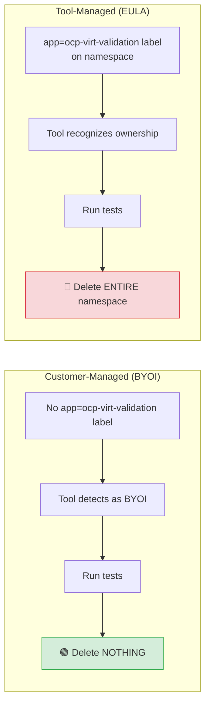
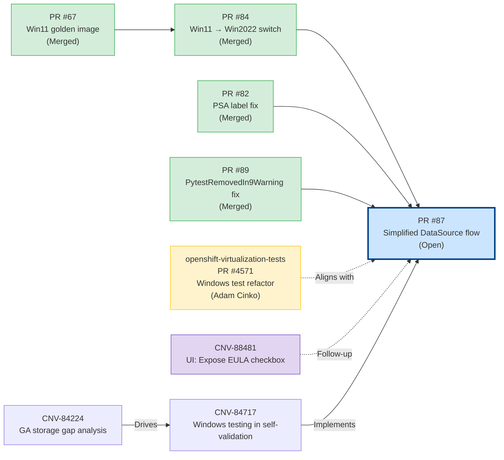
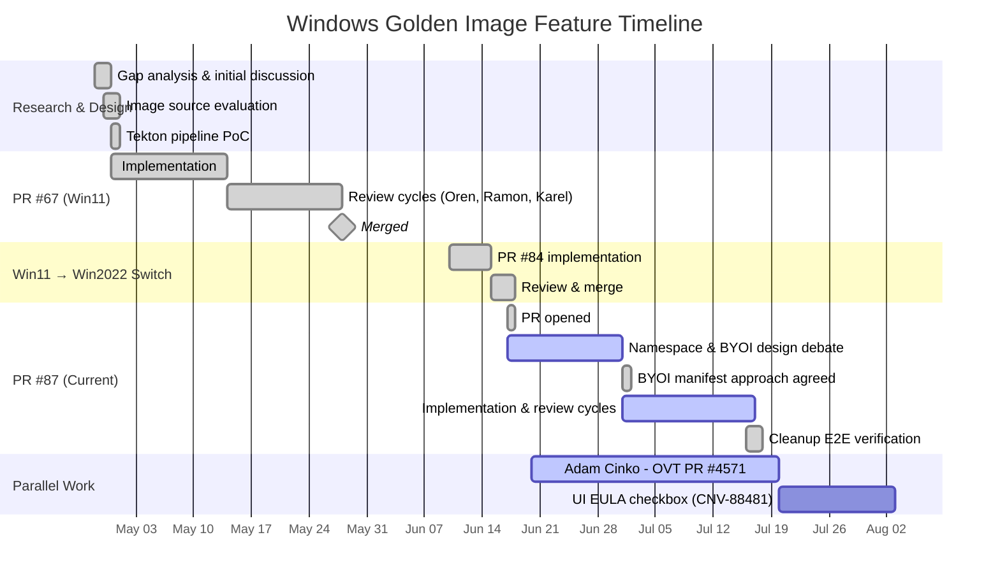

# Windows Server 2022 Golden Image — Design Document

> **Feature PR:** [#87](https://github.com/openshift-cnv/ocp-virt-validation-checkup/pull/87) &bull; **Target:** OCP Virtualization 5.0  
> **Author:** Ahmad Hafe &bull; **Last updated:** July 2026

---

## Table of Contents

1. [Executive Summary](#1-executive-summary)
2. [Background & Motivation](#2-background--motivation)
3. [Stakeholders](#3-stakeholders)
4. [Problem Statement](#4-problem-statement)
5. [Design Evolution & Key Decisions](#5-design-evolution--key-decisions)
6. [Final Architecture](#6-final-architecture)
7. [User Flows](#7-user-flows)
8. [Resource Lifecycle & Cleanup](#8-resource-lifecycle--cleanup)
9. [Obstacles & How They Were Resolved](#9-obstacles--how-they-were-resolved) 
10. [Verification Matrix](#10-verification-matrix)
11. [Related Work & Dependencies](#11-related-work--dependencies)
12. [Timeline](#12-timeline)
13. [References](#13-references)

---

## 1. Executive Summary

This document describes the design of Windows Server 2022 support in the **ocp-virt-validation-checkup** self-validation tool. The feature enables automated Windows testing as part of the storage GA certification workflow for cloud providers — a capability that was previously a complete gap.

**The core challenge:** Windows images cannot be redistributed due to Microsoft licensing. The solution uses a **Tekton pipeline** to install Windows from a publicly available ISO, with explicit human EULA acceptance as the gate. Two deployment paths are supported: **customer-managed** (user applies a manifest) and **tool-managed** (automated with cleanup).

### Key outcomes

- Windows testing gap in self-validation is closed
- No Microsoft bits are redistributed (legal compliance)
- Two clean paths: customer-managed (BYOI) and tool-managed (EULA)
- Deterministic cleanup — tool-created resources are always removed; user resources are never touched

---

## 2. Background & Motivation

### Origin: GA Storage Requirements

This feature originates from the **Cloud Validation and Storage Testing** requirements defined by **Peter Lauterbach** (PM for OpenShift Virtualization / CNV & RHV) in the [GA Storage Criteria document](https://docs.google.com/document/d/1XzBQtMQLMS3yidhqFhQDh1UYXB3yimIKUQtggJWABfM/edit). Peter's requirements define what must be validated before a cloud provider's storage can be certified as GA for OpenShift Virtualization. Among the requirements: the ability to spin up **Windows VMs**, perform Windows snapshot/restore operations, and run hotplug scenarios on Windows — all of which were a complete gap.

The strategic goal is to graduate self-validation into a **self-certification suite** that includes Windows coverage, so that customers and partners can validate their environments independently:

> *"We want to graduate this suite to become self certification suite, so that we don't have to run any tests ourselves."* — **Natalie Gavrilov**

A standalone Windows testing capability — without dependency on internal infrastructure like Artifactory — is essential for this vision.

### The Windows Gap

A gap analysis ([CNV-84224](https://redhat.atlassian.net/browse/CNV-84224)) against Peter's requirements revealed that Windows VM testing was a **complete gap** — no Windows tests existed anywhere in self-validation, full suite, or storage checkups:



| # | GA Requirement | Self-Validation | Full Suite | Storage Checkup | Notes |
|---|---------------|----------------|------------|-----------------|-------|
| 1 | Linux VM | :white_check_mark: | :white_check_mark: | :white_check_mark: | VM boot from golden image |
| 2 | **Windows VM** | :x: **GAP** | :x: **GAP** | :x: **GAP** | **No Windows tests anywhere** |
| 8 | Windows app-consistent snapshot | :x: **GAP** | :x: **GAP** | :x: **GAP** | No Windows, no timing |
| 16 | Hotplug/unplug | :white_check_mark: | :white_check_mark: | :white_check_mark: | Linux only — no Windows hotplug |

### The Artifactory/Quay Dependency Problem

Beyond the Windows gap, there was a fundamental infrastructure problem with **how** Windows images were consumed in the existing Tier-2/Tier-3 tests:



**The problem:** Tier-2 Windows tests pulled pre-built images from **internal Red Hat Artifactory** or **private Quay.io registries**. These images were licensed internally and stored behind authentication — the tests required `cnv-tests-artifactory-secret` and `artifactory-configmap` (certificate) to access them. External cloud users and partners do not have these credentials and cannot access these registries at all.

**The solution:** Replace the Artifactory/Quay dependency with a **golden image created on-cluster** via Tekton pipeline. This was implemented in two parallel tracks:
- **Self-validation** (this PR #87): Creates the golden image and DataSource
- **Test framework** (Adam Cinko's [PR #4571](https://github.com/RedHatQE/openshift-virtualization-tests/pull/4571)): Adapted Windows test fixtures to consume from the on-cluster DataSource for testing purposes

---

## 3. Stakeholders

### Key Contributors & Decision Makers

| Person | Title | Team | Role in This Feature |
|--------|-------|------|---------------------|
| **Peter Lauterbach** | Product Manager | OpenShift Virtualization / CNV & RHV | Defined the GA storage criteria and requirements that drive this feature. His [requirements document](https://docs.google.com/document/d/1XzBQtMQLMS3yidhqFhQDh1UYXB3yimIKUQtggJWABfM/edit) is the origin of the Windows testing gap. |
| **Ahmad Hafe** | Software Quality Engineer | Storage QE | Feature author — gap analysis, design, implementation, E2E testing across multiple clusters |
| **Ruth Netser** | Principal Software Quality Engineer | Code Maintainer | Design direction, code review, cleanup model architecture. Drove the binary ownership principle and namespace naming. |
| **Dan** | Director, Engineering | Engineering Leadership | Architecture guidance — proposed the two-step BYOI approach and dual-path vision |
| **Oren Cohen** | Senior Software Engineer | Install, Upgrade & Operators (IUO) | Tool owner — review, merge authority. Raised namespace isolation concern, approved final design. |
| **Dominik Holler** | Engineering Manager | Infrastructure & Windows Container (WINC) | Tekton pipeline expertise, EULA/legal guidance. Identified that MS EULA acceptance must come from a human. |
| **Felix Matouschek** | Principal Software Engineer | Infrastructure | Explored Validation OS alternative, provided upstream KubeVirt CI context for Windows images |
| **Karel Simon** | Senior Software Engineer | Infrastructure | Tekton pipeline review, RBAC scoping guidance (who should access the golden image) |
| **Ramon Lobillo** | Principal Software Quality Engineer | QE | QE review, backport policy — recommended testing thoroughly in 5.0 before backporting to 4.22.z |
| **Natalie Gavrilov** | Engineering Manager | OCP Virtualization (CNV) — Storage Ecosystem | Defined the self-certification vision. Clarified that the goal is coverage of important scenarios, not running maximum tests. |
| **Nasser Nassouli** | Engineering | Engineering | Clarified FULL_SUITE flag behavior and UI exposure options |
| **Jenia Peimer** | Engineering | Test Architecture | Tier-2 test alignment — defined how DataSource, DataVolume, and instance types should be wired across test suites |
| **Adam Cinko** | Software Engineer | Test Framework | Parallel PR ([#4571](https://github.com/RedHatQE/openshift-virtualization-tests/pull/4571)) — refactored all Windows tests to use DataSource from `validation-os-images` instead of Artifactory |

### Conversation Map

The design was shaped through discussions across multiple Slack threads and PR reviews:



---

## 4. Problem Statement

### Constraints

1. **Legal** — Microsoft EULA must be explicitly accepted by a human; no MS bits can be redistributed
2. **Infrastructure** — No guarantee that OpenShift Pipelines is installed on the target cluster
3. **Environment** — Must work on connected and disconnected clusters
4. **User experience** — Must be simple for customers who have no knowledge of test internals
5. **Resource safety** — Must never destroy user-created resources
6. **Test alignment** — Must align with the Tier-2/Tier-3 test framework's expectations for Windows VMs

### Requirements

- Windows Server 2022 with vTPM, SSH enabled, QEMU guest agent, `Administrator/Administrator` credentials
- Golden image as a DataSource for fast VM cloning during tests
- Cleanup of tool-created resources after test completion
- No modification to user-owned resources under any circumstances

---

## 5. Design Evolution & Key Decisions

The design went through **six major iterations** based on stakeholder feedback. Each pivot is documented below.



### Decision 1: Image Source — Why Tekton Pipeline?

Four approaches were evaluated:

| Approach | Source | Pros | Cons | Verdict |
|----------|--------|------|------|---------|
| **Artifactory** | Internal HTTP (qcow2) | Fast download | Requires internal secrets, not available externally | :x: Rejected |
| **Quay container disk** | Container registry | Small image (35Gi) | Private registry, requires special pull secrets | :x: Rejected |
| **Validation OS** | Microsoft free test OS | Free, lightweight | Private repo, requires token, limited OS | :x: Rejected |
| **Tekton pipeline** | Microsoft eval ISO | Publicly available, legal, full automation | Requires Pipelines operator, ~30-60 min first run | :white_check_mark: **Selected** |

> **Key insight from Dominik Holler:** *"I have my doubts if we are allowed to redistribute any bits from MS. For this reason I would recommend to build the Windows image using Tekton pipelines. This is quite reliable. It needs the explicit ack from a human user that he agrees with MS EULA."*

> **Legal requirement (also from Dominik):** *"Legal department just highlighted that the acceptance of the EULA should come from a human, so probably this would be a parameter to trigger the self validation."*

### Decision 2: Windows Version — Why Server 2022?

Originally implemented with Windows 11. Switched to Windows Server 2022 for stability:

| Factor | Windows 11 | Windows Server 2022 |
|--------|-----------|-------------------|
| OOBE behavior | Gets stuck at "Let's connect to a network" | Clean boot to desktop |
| Background processes | Forced updates, consumer telemetry | Minimal, server-grade |
| Test alignment | Tier-3 tests don't target Win11 | Tier-3 storage tests already target `win2k22` |
| Stability | Required BypassNRO registry hack | Works out of the box |

### Decision 3: Namespace — Why `validation-os-images`?

Significant debate about whether to use the existing `openshift-virtualization-os-images` namespace or a custom one:



> **Oren's concern:** *"This win image is used primarily for the self validation tests. It means that if an admin runs it, the win image will be available for all users. Not sure if we want that."*

> **Resolution:** Karel confirmed the Windows image is a vanilla evaluation install — safe for general access. But the team chose a dedicated namespace for clean isolation and deterministic cleanup.

### Decision 4: BYOI Model — Customer vs Tool Ownership

The most debated design question. Three approaches were proposed over multiple weeks:

| Iteration | Approach | Proposed By | Outcome |
|-----------|----------|-------------|---------|
| 1 | Tool clones user's PVC into test namespace | Ahmad | Rejected — too complex, unnecessary clone |
| 2 | User applies manifests, tool detects and uses | Dan, Ruth | Evolved — too many edge cases in detection |
| 3 | Binary ownership: user owns everything OR tool owns everything | Ruth | **Adopted** |

> **Ruth's guiding principle:** *"I think that we should keep it simple and to me it is legit to either have it all created by the customer, or all by us."*

> **Dan's vision:** *"It would be great if we have two steps: GUI that converts an ISO to a PVC, and self-validation-tool that assumes the PVC is there, with all the right permissions."*

### Decision 5: What to Ship for BYOI

Ruth requested that customers receive a complete, ready-to-use manifest:

> *"Why not provide the customer with exactly what is needed? i.e. a Tekton pipeline."*

This led to the creation of `manifests/windows/golden-image.yaml` — a single `oc apply` manifest with two methods:
- **Method 1** (default): Full Tekton pipeline (creates Windows from scratch)
- **Method 2** (commented out): DataVolume import for users with existing images (HTTP, registry, PVC clone, or upload)

---

## 6. Final Architecture

### High-Level Flow



### Component Overview



---

## 7. User Flows

### Option 1: Customer-Managed (BYOI)

The customer creates the golden image independently using the provided manifest.

| Step | Action | Who |
|------|--------|-----|
| 1 | Apply `manifests/windows/golden-image.yaml` | Customer |
| 2 | Wait for PipelineRun to complete (~30-60 min) | Customer |
| 3 | Verify DataSource is Ready | Customer |
| 4 | Run self-validation (no special flags needed) | Customer |
| 5 | Tool detects DataSource, runs Windows tests | Tool |
| 6 | No cleanup — customer owns all resources | Tool |

**Manifest contents:**

| Resource | Purpose |
|----------|---------|
| `Namespace` validation-os-images | Isolated namespace |
| `Role` + `RoleBinding` | CDI clone RBAC for test namespaces |
| `ServiceAccount` pipeline | For Tekton execution |
| `ClusterRoleBinding` (privileged SCC) | Pipeline needs privileged access |
| `ConfigMap` win2k22-autounattend | Sysprep: autounattend.xml + post-update.ps1 |
| `PipelineRun` win2022-install | Tekton pipeline (windows-efi-installer) |
| `DataSource` win2k22 | Points to the resulting PVC |

### Option 2: Tool-Managed (EULA)

The tool handles everything automatically.

| Step | Action | Who |
|------|--------|-----|
| 1 | Set `ACCEPT_WINDOWS_EULA=true` (UI checkbox or env var) | Customer |
| 2 | Optionally set `WIN_IMAGE_DOWNLOAD_URL` for custom ISO | Customer |
| 3 | Tool creates namespace, RBAC, runs pipeline | Tool |
| 4 | Tool runs Windows tests | Tool |
| 5 | Tool deletes entire `validation-os-images` namespace | Tool |

### Windows Image Configuration

The sysprep (autounattend.xml + post-update.ps1) produces a Windows Server 2022 image with:

| Component | Configuration |
|-----------|--------------|
| Boot | EFI with vTPM |
| Partitions | EFI (100MB) + MSR (16MB) + Windows (remaining) |
| Credentials | `Administrator` / `Administrator` |
| SSH | OpenSSH server enabled on port 22, auto-start |
| Guest Agent | QEMU guest agent installed via MSI |
| Firewall | Disabled (Domain, Public, Private profiles) |
| Auto-logon | Enabled for Administrator |
| Server Manager | Auto-launch disabled |
| Windows Update | Service disabled to prevent blocking shutdown |

---

## 8. Resource Lifecycle & Cleanup

### Ownership Model

The cleanup model is **binary** — based on who created the resources:



### Stale Resource Detection

If a previous tool run left behind resources (e.g., interrupted execution), the tool detects and handles them:

| Scenario | Detection | Action |
|----------|-----------|--------|
| Stale tool DS in **tool-owned NS** | NS has `app=ocp-virt-validation` label | Delete entire namespace |
| Stale tool DS in **user-owned NS** | DS has `app=ocp-virt-validation` label but NS does not | Delete only labeled resources, preserve NS |
| User DS in user NS | No tool labels anywhere | Leave everything untouched |

### Cleanup Function Chain

```
entrypoint.sh
  └── cleanup_windows_resources()
        └── cleanup_golden_image_resources(namespace)   [funcs.sh]
              ├── Is namespace tool-labeled?
              │   ├── Yes → oc delete namespace (deletes everything)
              │   └── No → "selective" cleanup
              │         ├── Delete PVCs with app=ocp-virt-validation
              │         ├── Delete DataSources with app=ocp-virt-validation
              │         ├── Delete DVs with app=ocp-virt-validation
              │         └── Delete RBAC with app=ocp-virt-validation
              └── Delete ClusterRoleBinding (if exists)
```

---

## 9. Obstacles & How They Were Resolved

### Obstacle 1: Microsoft EULA & Image Distribution

**Problem:** Cannot redistribute Windows images. Internal sources (Artifactory, Quay) require secrets unavailable to customers.

**Resolution:** Use the publicly available Microsoft evaluation ISO with the `windows-efi-installer` Tekton pipeline. EULA acceptance is gated by a human-controlled parameter (`ACCEPT_WINDOWS_EULA=true`), satisfying legal requirements.

**Key contributor:** Dominik Holler (EULA/legal guidance), Karel Simon (Tekton pipeline review)

---

### Obstacle 2: Namespace Ownership Debate

**Problem:** Should the Windows golden image live in the existing `openshift-virtualization-os-images` (alongside RHEL, Fedora images) or in a custom namespace?

**Arguments for `openshift-virtualization-os-images`:**
- All other golden images are there
- Tier-2 tests already look there for Windows images

**Arguments against:**
- Admin running the tool would make the Windows image available to all users
- Cleanup would risk existing golden images
- Test artifact should not be exposed to general users

**Resolution:** Use dedicated `validation-os-images` namespace. This required the parallel PR by Adam Cinko ([openshift-virtualization-tests#4571](https://github.com/RedHatQE/openshift-virtualization-tests/pull/4571)) to update all Windows test fixtures to look in the new namespace.

**Key contributors:** Oren Cohen (raised the concern), Ruth Netser (proposed the namespace name)

---

### Obstacle 3: BYOI vs Tool-Managed Approach

**Problem:** Multiple stakeholders had different views on how the user-provided-image path should work.

**Iterations:**
1. Tool clones user's PVC into test namespace → rejected (unnecessary complexity)
2. User provides PVC name via env var, tool wires everything → rejected (too many edge cases)
3. User applies full manifest themselves → **adopted** (clear ownership boundary)

**Resolution:** Ruth's principle of binary ownership — "either have it all created by the customer, or all by us" — was adopted. Dan's suggestion to support both paths was incorporated: BYOI manifest for customers, automated EULA flow for the tool.

---

### Obstacle 4: Test Framework Alignment

**Problem:** Tier-2 Windows tests used Artifactory-based images and DV-based creation. Self-validation uses DataSource-based cloning from `validation-os-images`.

**Resolution:** Parallel refactoring effort:
- **Adam Cinko** ([PR #4571](https://github.com/RedHatQE/openshift-virtualization-tests/pull/4571)): Refactored all Windows tests in openshift-virtualization-tests to use DataSource from `validation-os-images` instead of Artifactory
- **Ahmad Hafe** ([PR #87](https://github.com/openshift-cnv/ocp-virt-validation-checkup/pull/87)): Self-validation setup creates the DataSource in the same namespace

---

### Obstacle 5: Cleanup Edge Cases in User-Owned Namespaces

**Problem:** Ruth's code review identified that the initial cleanup implementation would delete a customer-owned namespace when `ACCEPT_WINDOWS_EULA` was set, even if the tool didn't create it.

**Resolution:** Introduced label-based ownership checking:
- Namespace with `app=ocp-virt-validation` label → tool-owned → delete everything
- Namespace without the label → user-owned → only delete individually labeled resources
- Refactored `cleanup_golden_image_resources()` into shared `funcs.sh` for reuse

---

---

## 10. Verification Matrix

### Core Scenarios

| # | Scenario | EULA | NS State | Expected Behavior | Verified |
|---|----------|------|----------|-------------------|----------|
| 1 | Clean cluster, no Windows image | No | N/A | Skip Windows tests | :white_check_mark: |
| 2 | BYOI DataSource Ready | No | User-owned | Detect BYOI, run tests, preserve NS | :white_check_mark: |
| 3 | BYOI DataSource Ready | Yes | User-owned | BYOI takes priority, skip pipeline, preserve NS | :white_check_mark: |
| 4 | No DataSource | Yes | Does not exist | Create NS, run pipeline, run tests, delete NS | :white_check_mark: |
| 5 | No DataSource | Yes | User-owned (no label) | Fail fast: "customer-owned namespace" | :white_check_mark: |
| 6 | Stale tool DS | No | User-owned | Delete stale DS only, preserve NS, skip Windows | :white_check_mark: |
| 7 | Stale tool DS | No | Tool-owned | Delete entire NS | :white_check_mark: |
| 8 | Tool-owned NS with image | Yes | Tool-owned | Reuse image, run tests, delete NS | :white_check_mark: |

### Cleanup Safety Matrix

| User Has | EULA | User Resources Safe? | What Happens |
|----------|------|---------------------|--------------|
| User-owned DataSource (Ready) | No | :white_check_mark: All preserved | BYOI detected, tests included |
| User-owned DataSource (Ready) | Yes | :white_check_mark: All preserved | BYOI takes priority over pipeline |
| No DataSource | No | :white_check_mark: All preserved | Windows tests skipped |
| No DataSource, user-owned NS | Yes | :white_check_mark: All preserved | Fail fast, user NS not modified |
| Stale tool DS in user NS | No | :white_check_mark: Only stale DS deleted | Selective cleanup, NS preserved |

---

## 11. Related Work & Dependencies



| Item | Type | Status | Relationship |
|------|------|--------|-------------|
| [PR #67](https://github.com/openshift-cnv/ocp-virt-validation-checkup/pull/67) | PR (self-validation) | Merged | Initial Win11 implementation |
| [PR #82](https://github.com/openshift-cnv/ocp-virt-validation-checkup/pull/82) | PR (self-validation) | Merged | PSA label fix for namespace |
| [PR #84](https://github.com/openshift-cnv/ocp-virt-validation-checkup/pull/84) | PR (self-validation) | Merged | Win11 → Win Server 2022 switch |
| [PR #87](https://github.com/openshift-cnv/ocp-virt-validation-checkup/pull/87) | PR (self-validation) | Open | This feature (simplified DataSource flow) |
| [PR #89](https://github.com/openshift-cnv/ocp-virt-validation-checkup/pull/89) | PR (self-validation) | Merged | Pytest warning fix |
| [OVT PR #4571](https://github.com/RedHatQE/openshift-virtualization-tests/pull/4571) | PR (test framework) | In Review | Windows test refactor (Adam Cinko) |
| [CNV-84224](https://redhat.atlassian.net/browse/CNV-84224) | Jira | In Progress | GA storage gap analysis |
| [CNV-84717](https://redhat.atlassian.net/browse/CNV-84717) | Jira | In Progress | Windows testing in self-validation |
| [CNV-88481](https://redhat.atlassian.net/browse/CNV-88481) | Jira | New | UI: Expose EULA acceptance checkbox |

---

## 12. Timeline



---

## 13. References

- **GA Storage Criteria:** [Google Doc](https://docs.google.com/document/d/1XzBQtMQLMS3yidhqFhQDh1UYXB3yimIKUQtggJWABfM/edit)
- **Gap Analysis:** [CNV-84224](https://redhat.atlassian.net/browse/CNV-84224)
- **Feature Jira:** [CNV-84717](https://redhat.atlassian.net/browse/CNV-84717)
- **UI EULA Jira:** [CNV-88481](https://redhat.atlassian.net/browse/CNV-88481)
- **Self-Validation PR:** [#87](https://github.com/openshift-cnv/ocp-virt-validation-checkup/pull/87)
- **Test Framework PR:** [OVT #4571](https://github.com/RedHatQE/openshift-virtualization-tests/pull/4571)
- **Tekton Pipeline:** [windows-efi-installer on ArtifactHub](https://artifacthub.io/packages/tekton-pipeline/redhat-pipelines/windows-efi-installer)
- **Customer Manifest:** [`manifests/windows/golden-image.yaml`](../manifests/windows/golden-image.yaml)
