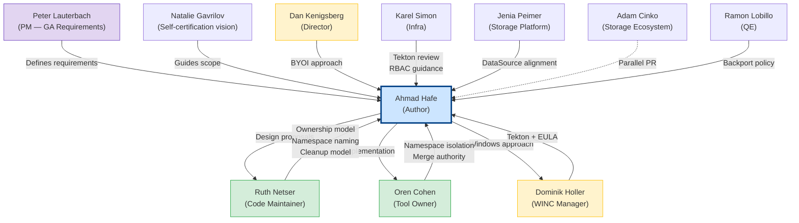
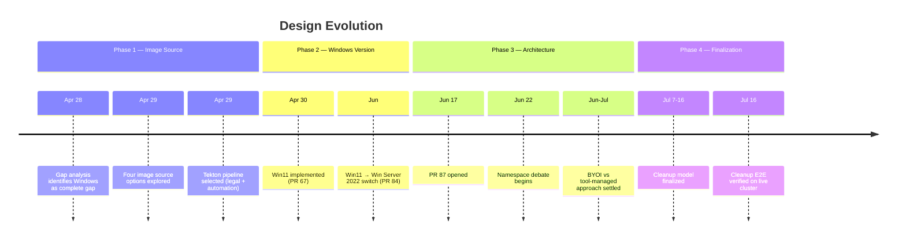
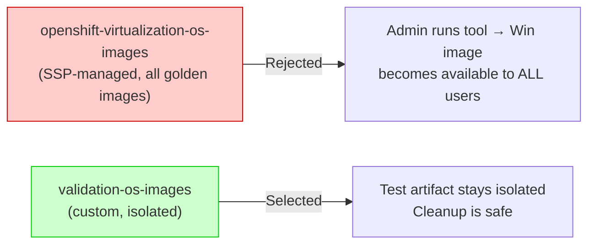
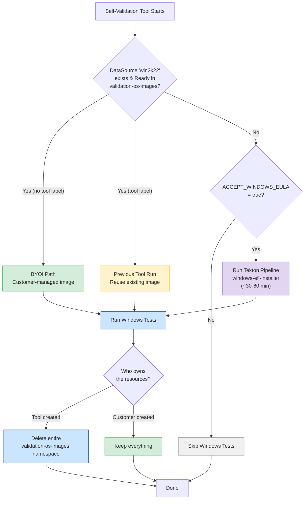
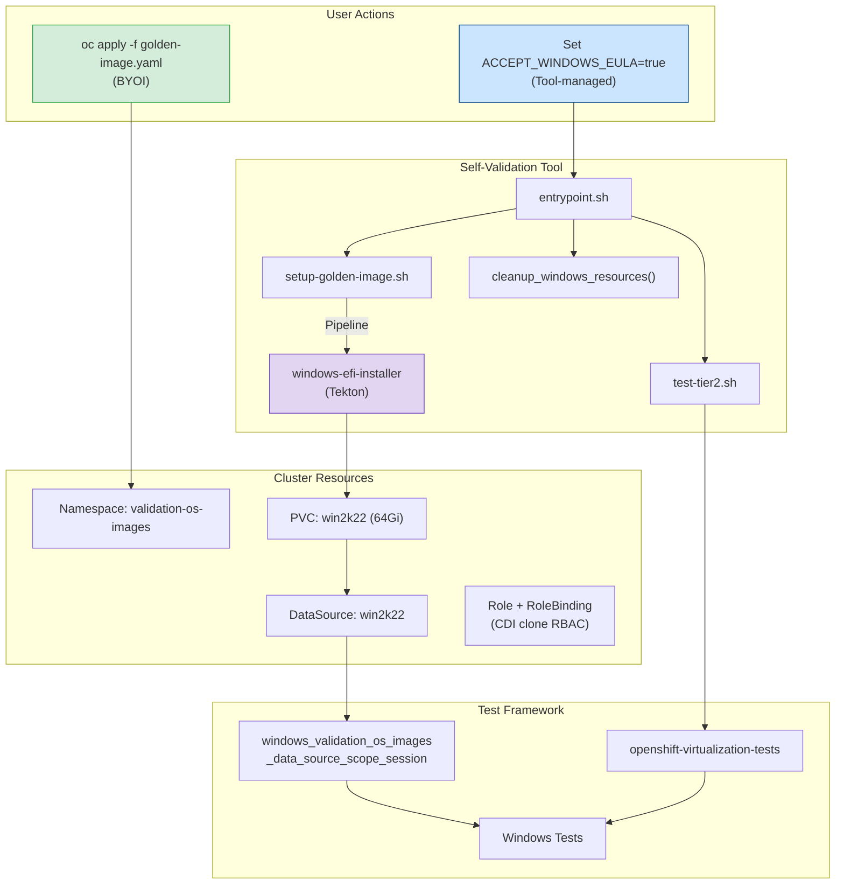
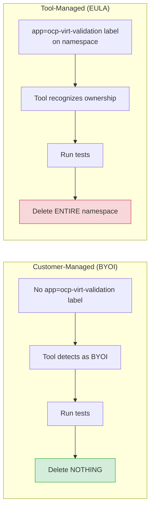
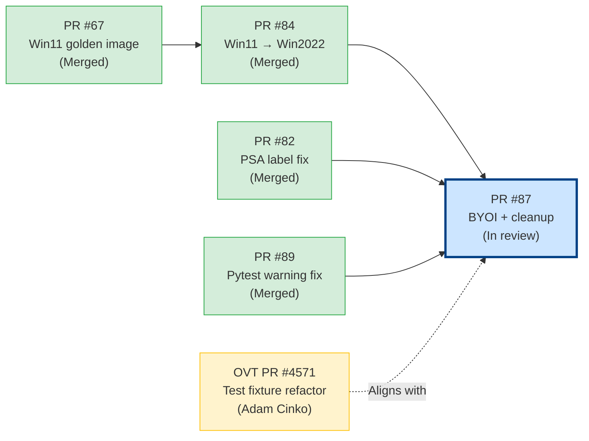
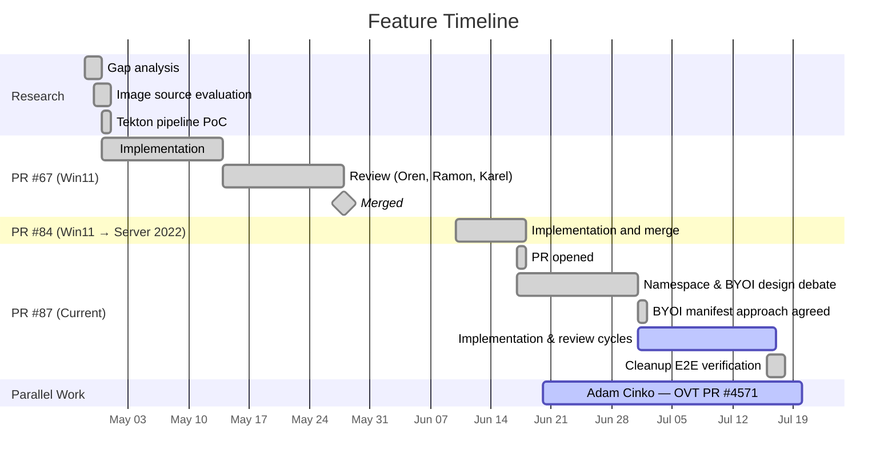
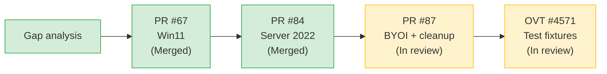

# Windows Golden Image — Feature Report

| | |
|---|---|
| **Author** | Ahmad Hafe |
| **Epic** | [CNV-84717](https://redhat.atlassian.net/browse/CNV-84717) |
| **Feature PR** | [#87](https://github.com/openshift-cnv/ocp-virt-validation-checkup/pull/87) |
| **Target** | OCP Virtualization 5.0 |
| **Last updated** | July 2026 |
| **Design doc** | [WINDOWS_GOLDEN_IMAGE_DESIGN.md](WINDOWS_GOLDEN_IMAGE_DESIGN.md) |

---

## Origin

Peter Lauterbach's [GA Storage Criteria](https://docs.google.com/document/d/1XzBQtMQLMS3yidhqFhQDh1UYXB3yimIKUQtggJWABfM/edit) requires Windows VM coverage for storage certification. A [gap analysis](https://redhat.atlassian.net/browse/CNV-84224) confirmed self-validation has no Windows tests. The Tier-2/Tier-3 suite has them, but they pull images from internal Artifactory and private Quay registries that cloud providers can't access.

## Contributors

| Person | Title | Team | Contribution |
|--------|-------|------|-------------|
| **Peter Lauterbach** | Product Manager | OpenShift Virtualization / CNV & RHV | Defined the [GA storage criteria](https://docs.google.com/document/d/1XzBQtMQLMS3yidhqFhQDh1UYXB3yimIKUQtggJWABfM/edit) that drive this feature |
| **Ahmad Hafe** | Software Quality Engineer | Storage Ecosystem | Feature author — gap analysis, design, implementation, E2E testing |
| **Ruth Netser** | Principal Software Quality Engineer | Code Maintainer | Design direction, ownership model, namespace naming, code review |
| **Dan Kenigsberg** | Director, Engineering | Engineering Leadership | Proposed the two-step BYOI approach |
| **Oren Cohen** | Senior Software Engineer | Install, Upgrade & Operators | Tool owner — raised namespace isolation concern, merge authority |
| **Dominik Holler** | Engineering Manager | Infrastructure & Windows Container (WINC) | Tekton pipeline expertise, EULA/legal guidance |
| **Felix Matouschek** | Principal Software Engineer | Infrastructure | Explored Validation OS alternative |
| **Karel Simon** | Senior Software Engineer | Infrastructure | Tekton pipeline review, RBAC scoping |
| **Ramon Lobillo** | Principal Software Quality Engineer | QE | QE review, backport policy |
| **Natalie Gavrilov** | Engineering Manager | OCP Virtualization (CNV) — Storage Ecosystem | Self-certification vision, scope guidance |
| **Nasser Nassouli** | Engineer | Engineering | Clarified FULL_SUITE flag behavior and UI exposure options |
| **Jenia Peimer** | Senior Software Engineer | Storage Platform | DataSource/DataVolume alignment across test suites |
| **Priya Parasuram** | Program Manager | Cloud Provider Validation | Project tracking, sprint priorities |
| **Adam Cinko** | Software Quality Engineer | Storage Ecosystem | Test fixture refactor ([OVT #4571](https://github.com/RedHatQE/openshift-virtualization-tests/pull/4571)) |

### Conversation Map

## Design Evolution

### Decision 1: Image Source

Four options were evaluated:

| Approach | Source | Why rejected / selected |
|----------|--------|------------------------|
| Artifactory | Internal HTTP (qcow2) | Requires internal secrets, not available to partners |
| Quay containerdisk | Private registry | Requires special pull secrets partners don't have |
| Validation OS | Microsoft free test OS | Private repo, requires token, limited OS |
| **Tekton pipeline** | Microsoft eval ISO | **Selected** — publicly available, legally compliant, automated |

Dominik Holler confirmed with the legal department that EULA acceptance must come from a human, which is why it's gated by `ACCEPT_WINDOWS_EULA=true`.

### Decision 2: Windows Version

Started with Windows 11 in [PR #67](https://github.com/openshift-cnv/ocp-virt-validation-checkup/pull/67). Switched to Server 2022 in [PR #84](https://github.com/openshift-cnv/ocp-virt-validation-checkup/pull/84):

| Factor | Windows 11 | Windows Server 2022 |
|--------|-----------|-------------------|
| OOBE behavior | Gets stuck at network screen | Clean boot to desktop |
| Background processes | Forced updates, telemetry | Minimal, server-grade |
| Test alignment | Tier-3 tests don't target Win11 | Tier-3 tests target `win2k22` |
| Stability | Required BypassNRO registry hack | Works out of the box |

### Decision 3: Namespace

Debated between `openshift-virtualization-os-images` (shared) and `validation-os-images` (dedicated):

Oren Cohen raised the concern. Karel Simon confirmed the image is a vanilla evaluation install, safe for general access, but the team chose a dedicated namespace for clean isolation. This required Adam Cinko's [OVT PR #4571](https://github.com/RedHatQE/openshift-virtualization-tests/pull/4571) to update all Windows test fixtures.

### Decision 4: Ownership Model

Three iterations:

| # | Approach | Proposed By | Result |
|---|----------|-------------|--------|
| 1 | Tool clones user's PVC into test namespace | Ahmad | Rejected — too complex |
| 2 | User applies manifests, tool detects and uses | Dan, Ruth | Evolved — too many edge cases |
| 3 | Either the customer owns everything or the tool does | Ruth | Adopted |

### Decision 5: BYOI Manifest

Ruth requested a complete manifest for partners. This became [`manifests/windows/golden-image.yaml`](../manifests/windows/golden-image.yaml) — namespace, RBAC, pipeline, sysprep configmap, and DataSource in a single `oc apply`.

## Obstacles

### 1. Microsoft EULA & Image Distribution

**Problem:** Can't redistribute Windows images. Internal sources require secrets partners don't have.

**Resolution:** Use the publicly available Microsoft evaluation ISO with the [`windows-efi-installer`](https://artifacthub.io/packages/tekton-pipeline/redhat-pipelines/windows-efi-installer) Tekton pipeline. EULA acceptance gated by `ACCEPT_WINDOWS_EULA=true`.

### 2. Namespace Ownership Debate

**Problem:** Should the golden image live in `openshift-virtualization-os-images` or a custom namespace?

**Resolution:** Dedicated `validation-os-images` namespace. Required Adam Cinko's [OVT PR #4571](https://github.com/RedHatQE/openshift-virtualization-tests/pull/4571) to update test fixtures.

### 3. BYOI vs Tool-Managed Approach

**Problem:** Multiple stakeholders had different views on how user-provided images should work.

**Resolution:** Ruth's ownership principle — either the customer owns everything or the tool does. Dan's suggestion to support both paths was incorporated: BYOI manifest for customers, automated EULA flow for the tool.

### 4. Test Framework Alignment

**Problem:** Tier-2 Windows tests used Artifactory-based images. Self-validation uses DataSource-based cloning from `validation-os-images`.

**Resolution:** Parallel refactoring — Adam Cinko ([OVT #4571](https://github.com/RedHatQE/openshift-virtualization-tests/pull/4571)) updated all Windows tests to use DataSource from `validation-os-images`.

### 5. Cleanup Edge Cases

**Problem:** Initial cleanup would delete a customer-owned namespace when `ACCEPT_WINDOWS_EULA` was set, even if the tool didn't create it. Found during Ruth's code review.

**Resolution:** Label-based ownership checking. Namespace with `app=ocp-virt-validation` label = tool-owned (delete everything). Without the label = user-owned (only delete individually labeled resources). Refactored into shared `funcs.sh`.

## Architecture

### Flow

### Components

### Cleanup

| Scenario | Detection | Action |
|----------|-----------|--------|
| Stale tool DS in tool-owned NS | NS has `app=ocp-virt-validation` label | Delete entire namespace |
| Stale tool DS in user-owned NS | DS has label but NS does not | Delete only labeled resources, preserve NS |
| User DS in user NS | No tool labels | Leave everything untouched |

## Verification

Cleanup verified on a live cluster, July 16-18, 2026:

| # | Scenario | EULA | NS State | Expected | Result |
|---|----------|------|----------|----------|--------|
| 1 | BYOI DataSource Ready | No | User-owned | Detect BYOI, run tests, preserve NS | Pass |
| 2 | BYOI DataSource Ready | Yes | User-owned | BYOI takes priority, skip pipeline, preserve NS | Pass |
| 3 | No DataSource | Yes | Does not exist | Create NS, run pipeline, run tests, delete NS | Pass |
| 4 | No DataSource | Yes | User-owned (no label) | Fail fast, user NS not modified | Pass |
| 5 | Stale tool DS | No | User-owned | Delete stale DS only, preserve NS, skip Windows | Pass |
| 6 | Stale tool DS | No | Tool-owned | Delete entire NS | Pass |
| 7 | Tool-owned NS with image | Yes | Tool-owned | Reuse image, run tests, delete NS | Pass |
| 8 | Clean cluster | No | N/A | Skip Windows tests | Pass |

## PR History

| PR | Status | Description |
|----|--------|-------------|
| [#67](https://github.com/openshift-cnv/ocp-virt-validation-checkup/pull/67) | Merged | Initial Win11 golden image |
| [#82](https://github.com/openshift-cnv/ocp-virt-validation-checkup/pull/82) | Merged | PSA label fix for namespace |
| [#84](https://github.com/openshift-cnv/ocp-virt-validation-checkup/pull/84) | Merged | Win11 → Server 2022 switch |
| [#87](https://github.com/openshift-cnv/ocp-virt-validation-checkup/pull/87) | In review | BYOI manifest, cleanup logic, simplified DataSource flow |
| [#89](https://github.com/openshift-cnv/ocp-virt-validation-checkup/pull/89) | Merged | PytestRemovedIn9Warning fix |
| [OVT #4571](https://github.com/RedHatQE/openshift-virtualization-tests/pull/4571) | In review | Windows test fixture refactor (Adam Cinko) |

## Timeline

## Current Status

[PR #87](https://github.com/openshift-cnv/ocp-virt-validation-checkup/pull/87) is in review. The parallel [OVT #4571](https://github.com/RedHatQE/openshift-virtualization-tests/pull/4571) updates the test fixtures to consume from the new `validation-os-images` namespace.

## References

- [GA Storage Criteria](https://docs.google.com/document/d/1XzBQtMQLMS3yidhqFhQDh1UYXB3yimIKUQtggJWABfM/edit) — Peter Lauterbach
- [Cloud Provider Sync Notes](https://docs.google.com/document/d/146x40wpeLPCYVcVMOQjwYno29qvdlh3OpSPxorLlkj0/edit) — Priya Parasuram
- [Gap Analysis — CNV-84224](https://redhat.atlassian.net/browse/CNV-84224)
- [Epic — CNV-84717](https://redhat.atlassian.net/browse/CNV-84717)
- [CNV-89353](https://redhat.atlassian.net/browse/CNV-89353) — T3 Windows in self-validation
- [Design Document](WINDOWS_GOLDEN_IMAGE_DESIGN.md)
- [Customer manifest](../manifests/windows/golden-image.yaml)
- [windows-efi-installer pipeline](https://artifacthub.io/packages/tekton-pipeline/redhat-pipelines/windows-efi-installer)
